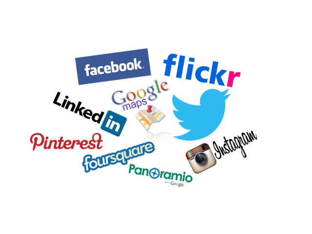
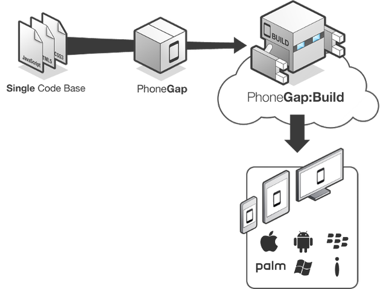
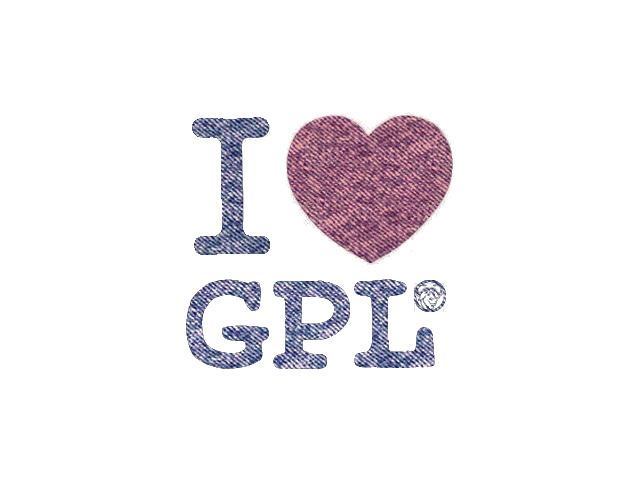

% Cliente API REST con LungoJS
% Adolfo Sanz De Diego
% Octubre 2013

# Acerca de

## El GUL

El GUL es el **Grupo de Usuarios de Linux de la UC3M**.

Grupo de personas con inquietudes en torno a la informática.

Con la idea común de la utilización y promoción del **Software Libre**.

Quedamos de vez en cuando y organizamos actividades sobre todo esto.

El punto de unión es la **lista de correo** que está abierta a todo el mundo.

## ¿Dónde encontrarnos?

Twitter:  [http://twitter.com/guluc3m](http://twitter.com/guluc3m)

Lista:    [gul@gul.uc3m.es](mailto:gul@gul.uc3m.es)

Ftp:      [ftp://ftp.gul.uc3m.es](ftp://ftp.gul.uc3m.es)

Web:      [http://www.gul.uc3m.es](http://www.gul.uc3m.es)

Podcast:  [http://holamundo.gul.es/](http://holamundo.gul.es/)

Blog:     [http://planeta.gul.uc3m.es/](http://planeta.gul.uc3m.es/)

Linkedin: [http://www.linkedin.com/groups?gid=3451836](http://www.linkedin.com/groups?gid=3451836)

## Adolfo Sanz De Diego

**Antiguo programador web JEE**

Hoy en día:

-  **Profesor de FP de informática**:

    - Hardware, Sistemas Operativos
    - Redes, Programación

-  **Formador Freelance**:

    - Java, Android
    - JavaScript, jQuery
    - JSF, Spring, Hibernate
    - Groovy & Grails

-  **Me gusta programar**

## Hackalover

**Para los amantes de los hackathones**

-  **Meetup**: [http://www.meetup.com/Hackathon-Lovers/](http://www.meetup.com/Hackathon-Lovers/)

-  **Twitter**: [http://twitter.com/HackathonLovers](http://twitter.com/HackathonLovers)

-  **Blog**: [http://hackathonlovers.tumblr.com/](http://hackathonlovers.tumblr.com/)

-  **LinkedIn**: [http://www.linkedin.com/groups/Hackathon-Lovers-6510465](http://www.linkedin.com/groups/Hackathon-Lovers-6510465)

-  **YouTube**: [http://www.youtube.com/channel/UCRwSe7jK-y62BMvIiNBV1qw](http://www.youtube.com/channel/UCRwSe7jK-y62BMvIiNBV1qw)

## Tweets Sentiment

Es un **analizador de tweets** que extrae información semántica para conocer
si el sentimiento general de los tweets de un determinado tema
es positivo o negativo.

-  **Web**: [http://tweetssentiment.com/](http://tweetssentiment.com/)

-  **Twitter**: [http://twitter.com/TweetsSentiment](http://twitter.com/TweetsSentiment)

## ¿Donde encontrarme?

Mi nick: **asanzdiego**

-  AboutMe:  [http://about.me/asanzdiego](http://about.me/asanzdiego)

-  GitHub:   [http://github.com/asanzdiego](http://github.com/asanzdiego)

-  Twitter:  [http://twitter.com/asanzdiego](http://twitter.com/asanzdiego)

-  Blog:     [http://asanzdiego.blogspot.com.es](http://asanzdiego.blogspot.com.es)

-  LinkedIn: [http://www.linkedin.com/in/asanzdiego](http://www.linkedin.com/in/asanzdiego)

-  Google+:  [http://plus.google.com/+AdolfoSanzDeDiego](http://plus.google.com/+AdolfoSanzDeDiego)

## Créditos

Estas **transparencias** están hechas con:

-  [https://github.com/asanzdiego/markdownslides](https://github.com/asanzdiego/markdownslides)

## Licencia

Estas **transparencias** están bajo una licencia:

-  [Creative Commons Reconocimiento-CompartirIgual 3.0](http://creativecommons.org/licenses/by-sa/3.0/es/)

El **código** de los programas están bajo una licencia:

-  [GPL 3.0](http://www.viti.es/gnu/licenses/gpl.html)

## Fuentes

Transparencias

-  [SlideShare](http://www.slideshare.net/asanzdiego/cliente-api-rest-con-lungojs)

-  [Deck Slides](http://asanzdiego.github.io/curso-api-restful-lungojs-client-2013/slides/export/cliente-api-rest-con-lungojs-deck-slides.html)

-  [Reveal Slides](http://asanzdiego.github.io/curso-api-restful-lungojs-client-2013/slides/export/cliente-api-rest-con-lungojs-reveal-slides.html)

-  [Plain HTML](http://asanzdiego.github.io/curso-api-restful-lungojs-client-2013/slides/export/cliente-api-rest-con-lungojs.html)

Código

-  [https://github.com/asanzdiego/curso-api-restful-lungojs-client-2013/tree/master/src](https://github.com/asanzdiego/curso-api-restful-lungojs-client-2013/tree/master/src)

# APIs ¿Para qué?

## Aplicación estándar

## Introducimos API

## Separación Roles

## ¿Y ahora qué?

## Servicios externos

## Apps clientes

## Apps de servicios

## Apps mixtas

## Plataforma

## ¿Quien expone APIs?

## ¿Quien expone APIs?

## ¿Quien expone APIs?

## Exponlas tú

## Exponlas tú

## Exponlas tú

# APIs RESTful

## ¿Qué es REST?

REST (**Representational State Transfer**) es una técnica de arquitectura de
  software para sistemas hipermedia distribuidos como la World Wide Web.

En REST una **URL** (Uniform Resource Locator) representa un **recurso**.

Se puede acceder al recurso o modificarlo mediante los **métodos del protocolo HTTP**:

        GET, POST, PUT, DELETE

## Ejemplo API

**http://myhost.com/talk**

-  GET > Devuelve todas las charlas.

-  POST > Crear una nueva charla.

**http://myhost.com/talk/123**

-  GET > Devuelve la charla con id=123

-  PUT > Actualiza la charla con id=123

-  DELETE > Borra la charla con id=123

## Manejo de errores

**Se pueden utilizar los errores del protocolo HTTP**:

-  200 Successful

-  201 Created

-  202 Accepted

-  301 Moved Permanently

-  400 Bad Request

-  401 Unauthorised

-  402 Payment Required

-  403 Forbidden

-  404 Not Found

-  405 Method Not Allowed

-  500 Internal Server Error

-  501 Not Implemented

## ¿Por qué REST?

Es **más sencillo** (tanto la API como la implementación).

Es **más rápido** (peticiones más lijeras que se pueden cachear).

Es **multiformato** (HTML, XML, JSON, etc.).

Se complementa muy bien con **AJAX**.

## REST vs RESTful

REST se refiere a un tipo de arquitectura de software

-  Se utiliza como **nombre**

-  Se utiliza como por ejemplo: success = éxito.

Si un servicio web es REST**ful** indica que implementa dicha arquitectura.

-  Se utiliza como **adjetivo**

-  Se utiliza como por ejemplo: success**ful** = éxito**so**).

## REST vs RESTful

A veces el **ful** se confunde con **full** = completo.

-  Y se refiere a los servicios web REST**full** 

            Aquellos que implementan una API con
            todos los métodos del protócolo HTTP.

-  Y se refiere a los servicios web REST (**sin el full**)

            Aquellos que NO implementan una API con
            todos los métodos del protócolo HTTP.

# Clientes multidispositivo

## Distintos dispositivos

## Distintos OS

## Distintos OS

## Distintos navegadores

## ¡¡¡Socorro!!!

## Al rescate

## Graceful Degradation

## Graceful Degradation

## Progressive Enhancement

## Phonegap

# Lungo.js

## Competidores

jQTouch: [http://jqtjs.com/](http://jqtjs.com/)

Sencha Touch: [http://www.sencha.com/products/touch/](http://www.sencha.com/products/touch/)

jQueryMobile: [http://jquerymobile.com/](http://jquerymobile.com/)

hammer.js: [http://eightmedia.github.io/hammer.js/](http://eightmedia.github.io/hammer.js/)

## ¿Por qué Lungo?

## ¿Licencia GPL?

## ¿Español?

## Pues no

## Me gusta

## Aburrido

# Código

## Aplausos

## Directorios

Puedes usar la estructura de directorios que quieras.

Yo he usado esta:

-  **html**: los HTML con una carpeta para cada entidad del domino

-  **js**: los JS con una carpeta para cada entidad del domino

-  **lib**: carpeta con las dependencias a otros proyectos

    - Lungo depende de Quo que es una librería de los mismos auotres
          de 'tipo' jQuery enfocada a móviles

## js/util.js

~~~{.JavaScript}
// Searh
$$('document').ready(function(){
    Lungo.dom('input[type=search]').on('keyup', ...);
});

// Server URL
var util_server_url = "http://localhost:3000";

// Error Notification
var util_errorNotification = function(message, error) {
    Lungo.Notification.error(message, "", "warning-sign", 2);
};

// Métodos REST
var util_ajaxGet = function(url, data, callback) {
    $$.get(util_server_url+url, data, ..., 'json');
};
var util_ajaxPost = function(url, data, callback) {...};
var util_ajaxPut = function(url, data, callback) {...};
var util_ajaxDelete = function(url, data, callback) {...};
~~~

## html/talk/talk-add.html

~~~{.html}
<body class="app">
 <section id="main" data-transition="">
  <header data-title="Add Talk" class="extended"></header>
  <footer>
   <nav>
    
    
   </nav>
  </footer>
  <article id="main-article" class="active list">
   

    <fieldset>
     <label>NAME:</label><input type="text" id="talkName" />
    </fieldset>...
   

   

    <a href="#addTalk" id="addTalk" class="button">Add</a>
    <a href="talk-list.html" class="button cancel">Cancel</a>
   

  </article>
 </section>
</body>
~~~

## html/talk/talk-add.html

## js/talk/talk-add.js

~~~{.JavaScript}
$$('#addTalk').tap(function(){

 var data = {
  talkName:        $$("#talkName").val(),
  talkDate:        util_stringToDate($$("#talkDate").val()),
  talkSpeaker:     $$("#talkSpeaker").val(),
  talkSpeakerMail: $$("#talkSpeakerMail").val(),
  talkPoints:      $$("#talkPoints").val()
 };

 // send data to server
 util_ajaxPost('/talk', data, function(json) {
  if(!json || json.error) {
   util_errorNotification('ERROR adding talk', json.error);
  } else {
   util_successNotification('Talk saved', function() {
    window.location.replace('talk-list.html');
   });
  }
 });
});
~~~

## html/talk/talk-edit.html

~~~{.html}
<body class="app">
 <section id="main" data-transition="">
  <header data-title="Edit Talk" class="extended"></header>
  <nav data-control="groupbar">
   <a href="#editTalkArticle" ...>Edit</a>
   <a href="#deleteTalkArticle" ...>Delete</a>
  </nav>
  <footer>
   ...
  </footer>
  <article id="editTalkArticle" class="list indented scroll">
   ...
  </article>
  <article id="deleteTalkArticle" class="list indented scroll">
   ...
  </article>
 </section>
</body>
~~~

## html/talk/talk-edit.html

## html/talk/talk-edit.html

## js/talk/talk-get.js

~~~{.JavaScript}
$$('document').ready(function(){

 var talkId = util_urlParams["talkId"];

 // get data from server
 util_ajaxGet('/talk/'+talkId, {}, function(json) {
  if(!json || json.error) {
   util_errorNotification('ERROR retrieving talk', json.error);
  } else {
   var talk = json;
   console.log('Talk retrieved');
   drawTalk(talk);
  }
 });

 // draw data
 var drawTalk = function(talk) {
  $$("#talkName").val(talk.talkName);
  ...
 };
});
~~~

## js/talk/talk-update.js

~~~{.JavaScript}
$$('#saveTalk').tap(function(){

 var talkId = util_urlParams["talkId"];

 var data = {
  talkName:        $$("#talkName").val(),
  ...
 };

 // send data to server
 util_ajaxPut('/talk/'+talkId, data, function(json) {
  if(!json || json.error) {
   util_errorNotification('ERROR saving talk', json.error);
  } else {
   util_successNotification('Talk saved', function() {
    window.location.replace('talk-list.html');
   });
  }
 });
});
~~~

## js/talk/talk-delete.js

~~~{.JavaScript}
$$('#deleteTalk').tap(function(){

 var talkId = util_urlParams["talkId"];

 // send data to server
 util_ajaxDelete('/talk/'+talkId, {}, function(json) {
  if(!json || json.error) {
   util_errorNotification('ERROR deleting talk', json.error);
  } else {
   util_successNotification('Talk deleted', function() {
    window.location.replace('talk-list.html');
   });
  }
 });
});
~~~

## html/talk/talk-list.html

~~~{.html}
<body class="app">
 <section id="main" data-transition="">
  <header data-title="Talks List" class="extended"></header>
  <footer>
   <nav>
    
    
   </nav>
  </footer>
  <article id="main-article" class="active list indented scroll">
   

    <fieldset data-icon="search">
     <input type="search" placeholder="Search...">
    </fieldset>
   

   <ul id="talks"></ul>
  </article>
 </section>
</body>
~~~

## html/talk/talk-list.html

## html/talk/talk-list.html

## js/talk/talk-list.js

~~~{.JavaScript}
$$('document').ready(function(){

 // get data from server
 util_ajaxGet('/talk', {}, function(json) {
  if(!json || json.error) {
   util_errorNotification('ERROR retrieving talks', json.error);
  } else {
   drawTalks(json);
  }
 });

 // draw data
 var drawTalks = function(talks) {
  for (var i = 0; i < talks.length; i++) {
   var talk = talks[i];
   $$("#talks").append(
    '<li data-action="search" class="selectable">'+
     '<a href="talk-edit.html?talkId='+talk._id+'">'+
      '<strong>'+talk.talkName+'</strong></a></li>');
  }
 };
});
~~~

# Demo

# ¿Alguna pregunta?
