% Cliente API REST con LungoJS
% Adolfo Sanz De Diego
% Octubre 2013

# Acerca de

## El GUL

- El GUL es el **Grupo de Usuarios de Linux de la UC3M**.
- Grupo de personas con inquietudes en torno a la informática.
- Con la idea común de la utilización y promoción del **Software Libre**.
- Quedamos de vez en cuando y organizamos actividades sobre todo esto.
- El punto de unión es la **lista de correo** que está abierta a todo el mundo.

## ¿Dónde encontrarnos?

- Twitter:  [http://twitter.com/guluc3m](http://twitter.com/guluc3m)
- Lista:    [gul@gul.uc3m.es](mailto:gul@gul.uc3m.es)
- Ftp:      [ftp://ftp.gul.uc3m.es](ftp://ftp.gul.uc3m.es)
- Web:      [http://www.gul.uc3m.es](http://www.gul.uc3m.es)
- Podcast:  [http://holamundo.gul.es/](http://holamundo.gul.es/)
- Blog:     [http://planeta.gul.uc3m.es/](http://planeta.gul.uc3m.es/)
- Linkedin: [http://www.linkedin.com/groups?gid=3451836](http://www.linkedin.com/groups?gid=3451836)

## Adolfo Sanz De Diego

- **Antiguo programador web JEE**

- Hoy en día:

    - **Profesor de FP de informática**:

        - Hardware, Sistemas Operativos
        - Redes, Programación

    - **Formador Freelance**:

        - Java, Android
        - JavaScript, jQuery
        - JSF, Spring, Hibernate
        - Groovy & Grails

    - **Me gusta programar**

## Hackalover

- **Para los amantes de los hackathones**

    - **Meetup**: [http://www.meetup.com/Hackathon-Lovers/](http://www.meetup.com/Hackathon-Lovers/)
    - **Twitter**: [http://twitter.com/HackathonLovers](http://twitter.com/HackathonLovers)
    - **Blog**: [http://hackathonlovers.tumblr.com/](http://hackathonlovers.tumblr.com/)
    - **LinkedIn**: [http://www.linkedin.com/groups/Hackathon-Lovers-6510465](http://www.linkedin.com/groups/Hackathon-Lovers-6510465)
    - **YouTube**: [http://www.youtube.com/channel/UCRwSe7jK-y62BMvIiNBV1qw](http://www.youtube.com/channel/UCRwSe7jK-y62BMvIiNBV1qw)

## Tweets Sentiment

- Es un **analizador de tweets** que extrae información semántica para conocer
si el sentimiento general de los tweets de un determinado tema
es positivo o negativo.

    - **Web**: [http://tweetssentiment.com/](http://tweetssentiment.com/)
    - **Twitter**: [http://twitter.com/TweetsSentiment](http://twitter.com/TweetsSentiment)

## ¿Donde encontrarme?

- Mi nick: **asanzdiego**

    - AboutMe:  [http://about.me/asanzdiego](http://about.me/asanzdiego)
    - GitHub:   [http://github.com/asanzdiego](http://github.com/asanzdiego)
    - Twitter:  [http://twitter.com/asanzdiego](http://twitter.com/asanzdiego)
    - Blog:     [http://asanzdiego.blogspot.com.es](http://asanzdiego.blogspot.com.es)
    - LinkedIn: [http://www.linkedin.com/in/asanzdiego](http://www.linkedin.com/in/asanzdiego)
    - Google+:  [http://plus.google.com/+AdolfoSanzDeDiego](http://plus.google.com/+AdolfoSanzDeDiego)

## Créditos

- Estas **transparencias** están hechas con:

    - [https://github.com/asanzdiego/markdownslides](https://github.com/asanzdiego/markdownslides)

## Licencia

- Estas **transparencias** están bajo una licencia:
    - [Creative Commons Reconocimiento-CompartirIgual 3.0](http://creativecommons.org/licenses/by-sa/3.0/es/)

- El **código** de los programas están bajo una licencia:
    - [GPL 3.0](http://www.viti.es/gnu/licenses/gpl.html)

## Fuentes

- Transparencias

    - [SlideShare](http://www.slideshare.net/asanzdiego/cliente-api-rest-con-lungojs)

    - [Deck Slides](http://asanzdiego.github.io/curso-api-restful-lungojs-client-2013/slides/export/cliente-api-rest-con-lungojs-deck-slides.html)

    - [Reveal Slides](http://asanzdiego.github.io/curso-api-restful-lungojs-client-2013/slides/export/cliente-api-rest-con-lungojs-reveal-slides.html)

    - [Plain HTML](http://asanzdiego.github.io/curso-api-restful-lungojs-client-2013/slides/export/cliente-api-rest-con-lungojs.html)

- Código

    - [https://github.com/asanzdiego/curso-api-restful-lungojs-client-2013/tree/master/src](https://github.com/asanzdiego/curso-api-restful-lungojs-client-2013/tree/master/src)

# APIs ¿Para qué?

## Aplicación estándar

## Introducimos API

## Separación Roles

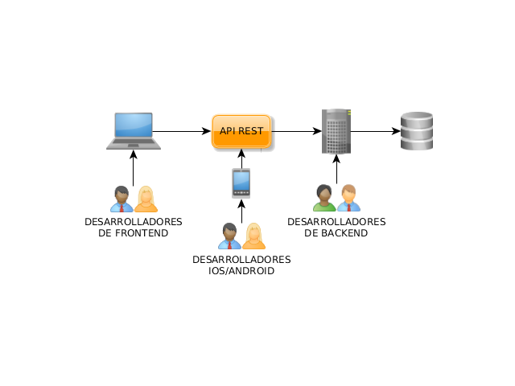

## ¿Y ahora qué?

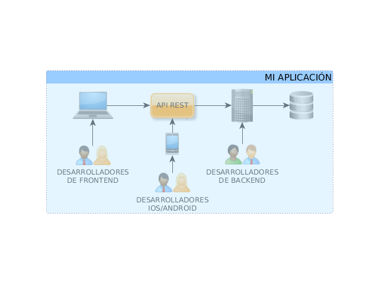

## Servicios externos

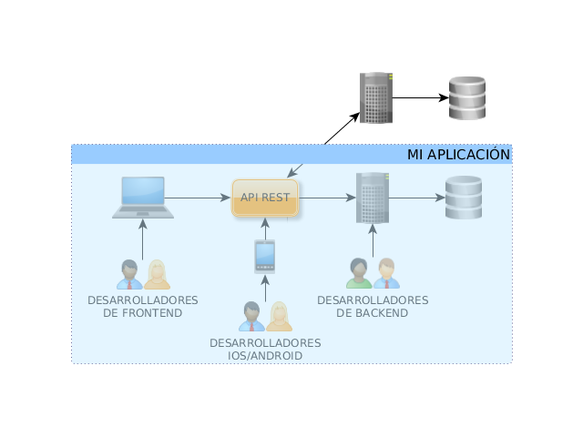

## Apps clientes

## Apps de servicios

## Apps mixtas

## Plataforma

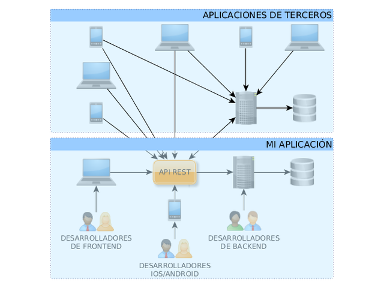

## ¿Quien expone APIs?

## ¿Quien expone APIs?

## ¿Quien expone APIs?

## Exponlas tú

## Exponlas tú

## Exponlas tú

# APIs RESTful

## ¿Qué es REST?

- REST (**Representational State Transfer**) es una técnica de arquitectura de
  software para sistemas hipermedia distribuidos como la World Wide Web.

- En REST una **URL** (Uniform Resource Locator) representa un **recurso**.

- Se puede acceder al recurso o modificarlo mediante los **métodos del protocolo HTTP**:

        GET, POST, PUT, DELETE

## Ejemplo API

- **http://myhost.com/talk**

    - GET > Devuelve todas las charlas.
    - POST > Crear una nueva charla.

- **http://myhost.com/talk/123**

    - GET > Devuelve la charla con id=123
    - PUT > Actualiza la charla con id=123
    - DELETE > Borra la charla con id=123

## Manejo de errores

- **Se pueden utilizar los errores del protocolo HTTP**:

    - 200 Successful
    - 201 Created
    - 202 Accepted
    - 301 Moved Permanently
    - 400 Bad Request
    - 401 Unauthorised
    - 402 Payment Required
    - 403 Forbidden
    - 404 Not Found
    - 405 Method Not Allowed
    - 500 Internal Server Error
    - 501 Not Implemented

## ¿Por qué REST?

- Es **más sencillo** (tanto la API como la implementación).
- Es **más rápido** (peticiones más lijeras que se pueden cachear).
- Es **multiformato** (HTML, XML, JSON, etc.).
- Se complementa muy bien con **AJAX**.

## REST vs RESTful

- REST se refiere a un tipo de arquitectura de software

    - Se utiliza como **nombre**
    - Se utiliza como por ejemplo: success = éxito.

- Si un servicio web es REST**ful** indica que implementa dicha arquitectura.

    - Se utiliza como **adjetivo**
    - Se utiliza como por ejemplo: success**ful** = éxito**so**).

## REST vs RESTful

- A veces el **ful** se confunde con **full** = completo.

    - Y se refiere a los servicios web REST**full** 

            Aquellos que implementan una API con
            todos los métodos del protócolo HTTP.

    - Y se refiere a los servicios web REST (**sin el full**)

            Aquellos que NO implementan una API con
            todos los métodos del protócolo HTTP.

# Clientes multidispositivo

## Distintos dispositivos

## Distintos OS

## Distintos OS

## Distintos navegadores

## ¡¡¡Socorro!!!

## Al rescate

## Graceful Degradation

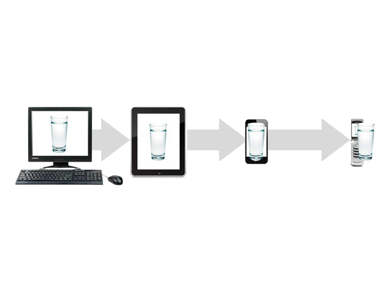

## Graceful Degradation

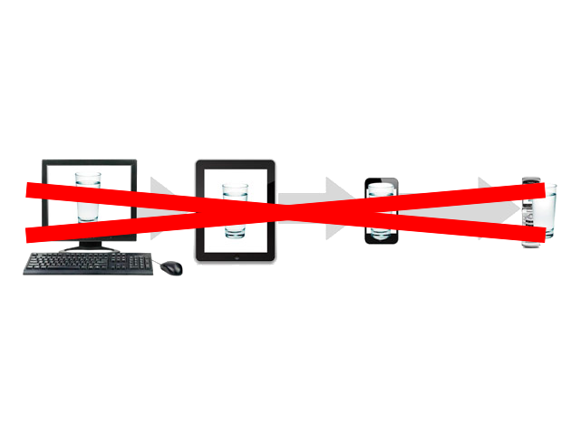

## Progressive Enhancement

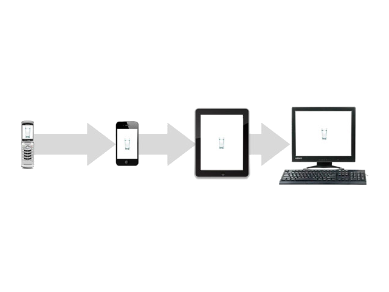

## Phonegap

# Lungo.js

## Competidores

- jQTouch: [http://jqtjs.com/](http://jqtjs.com/)
- Sencha Touch: [http://www.sencha.com/products/touch/](http://www.sencha.com/products/touch/)
- jQueryMobile: [http://jquerymobile.com/](http://jquerymobile.com/)
- hammer.js: [http://eightmedia.github.io/hammer.js/](http://eightmedia.github.io/hammer.js/)

## ¿Por qué Lungo?

## ¿Licencia GPL?

## ¿Español?

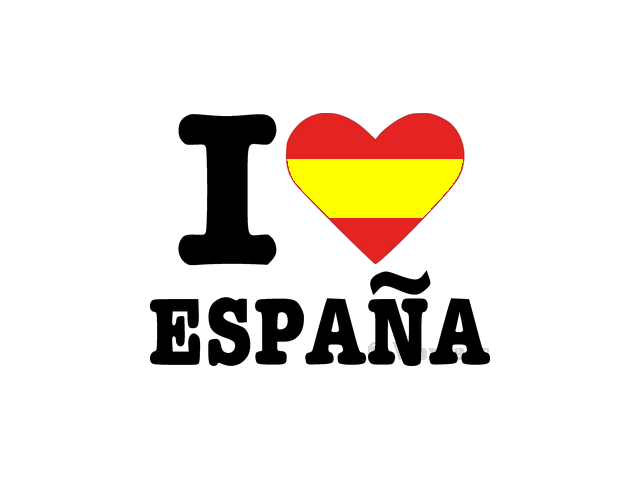

## Pues no

## Me gusta

## Aburrido

# Código

## Aplausos

## Directorios

- Puedes usar la estructura de directorios que quieras.

- Yo he usado esta:

    - **html**: los HTML con una carpeta para cada entidad del domino
    - **js**: los JS con una carpeta para cada entidad del domino
    - **lib**: carpeta con las dependencias a otros proyectos

        - Lungo depende de Quo que es una librería de los mismos auotres
          de 'tipo' jQuery enfocada a móviles

## js/util.js

~~~{.JavaScript}
// Searh
$$('document').ready(function(){
    Lungo.dom('input[type=search]').on('keyup', ...);
});

// Server URL
var util_server_url = "http://localhost:3000";

// Error Notification
var util_errorNotification = function(message, error) {
    Lungo.Notification.error(message, "", "warning-sign", 2);
};

// Métodos REST
var util_ajaxGet = function(url, data, callback) {
    $$.get(util_server_url+url, data, ..., 'json');
};
var util_ajaxPost = function(url, data, callback) {...};
var util_ajaxPut = function(url, data, callback) {...};
var util_ajaxDelete = function(url, data, callback) {...};
~~~

## html/talk/talk-add.html

~~~{.html}
<body class="app">
 <section id="main" data-transition="">
  <header data-title="Add Talk" class="extended"></header>
  <footer>
   <nav>
    
    
   </nav>
  </footer>
  <article id="main-article" class="active list">
   

    <fieldset>
     <label>NAME:</label><input type="text" id="talkName" />
    </fieldset>...
   

   

    <a href="#addTalk" id="addTalk" class="button">Add</a>
    <a href="talk-list.html" class="button cancel">Cancel</a>
   

  </article>
 </section>
</body>
~~~

## html/talk/talk-add.html

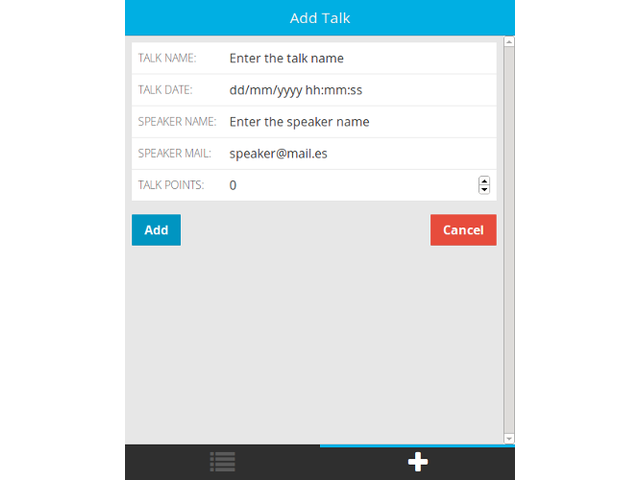

## js/talk/talk-add.js

~~~{.JavaScript}
$$('#addTalk').tap(function(){

 var data = {
  talkName:        $$("#talkName").val(),
  talkDate:        util_stringToDate($$("#talkDate").val()),
  talkSpeaker:     $$("#talkSpeaker").val(),
  talkSpeakerMail: $$("#talkSpeakerMail").val(),
  talkPoints:      $$("#talkPoints").val()
 };

 // send data to server
 util_ajaxPost('/talk', data, function(json) {
  if(!json || json.error) {
   util_errorNotification('ERROR adding talk', json.error);
  } else {
   util_successNotification('Talk saved', function() {
    window.location.replace('talk-list.html');
   });
  }
 });
});
~~~

## html/talk/talk-edit.html

~~~{.html}
<body class="app">
 <section id="main" data-transition="">
  <header data-title="Edit Talk" class="extended"></header>
  <nav data-control="groupbar">
   <a href="#editTalkArticle" ...>Edit</a>
   <a href="#deleteTalkArticle" ...>Delete</a>
  </nav>
  <footer>
   ...
  </footer>
  <article id="editTalkArticle" class="list indented scroll">
   ...
  </article>
  <article id="deleteTalkArticle" class="list indented scroll">
   ...
  </article>
 </section>
</body>
~~~

## html/talk/talk-edit.html

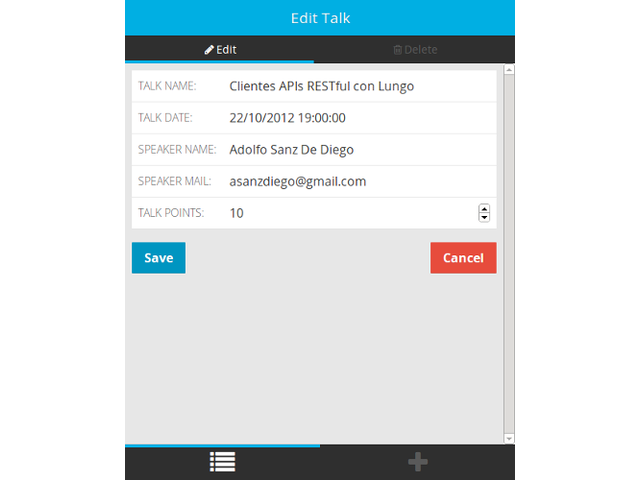

## html/talk/talk-edit.html

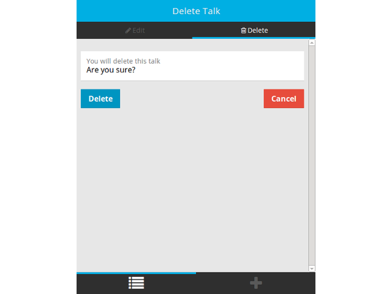

## js/talk/talk-get.js

~~~{.JavaScript}
$$('document').ready(function(){

 var talkId = util_urlParams["talkId"];

 // get data from server
 util_ajaxGet('/talk/'+talkId, {}, function(json) {
  if(!json || json.error) {
   util_errorNotification('ERROR retrieving talk', json.error);
  } else {
   var talk = json;
   console.log('Talk retrieved');
   drawTalk(talk);
  }
 });

 // draw data
 var drawTalk = function(talk) {
  $$("#talkName").val(talk.talkName);
  ...
 };
});
~~~

## js/talk/talk-update.js

~~~{.JavaScript}
$$('#saveTalk').tap(function(){

 var talkId = util_urlParams["talkId"];

 var data = {
  talkName:        $$("#talkName").val(),
  ...
 };

 // send data to server
 util_ajaxPut('/talk/'+talkId, data, function(json) {
  if(!json || json.error) {
   util_errorNotification('ERROR saving talk', json.error);
  } else {
   util_successNotification('Talk saved', function() {
    window.location.replace('talk-list.html');
   });
  }
 });
});
~~~

## js/talk/talk-delete.js

~~~{.JavaScript}
$$('#deleteTalk').tap(function(){

 var talkId = util_urlParams["talkId"];

 // send data to server
 util_ajaxDelete('/talk/'+talkId, {}, function(json) {
  if(!json || json.error) {
   util_errorNotification('ERROR deleting talk', json.error);
  } else {
   util_successNotification('Talk deleted', function() {
    window.location.replace('talk-list.html');
   });
  }
 });
});
~~~

## html/talk/talk-list.html

~~~{.html}
<body class="app">
 <section id="main" data-transition="">
  <header data-title="Talks List" class="extended"></header>
  <footer>
   <nav>
    
    
   </nav>
  </footer>
  <article id="main-article" class="active list indented scroll">
   

    <fieldset data-icon="search">
     <input type="search" placeholder="Search...">
    </fieldset>
   

   <ul id="talks"></ul>
  </article>
 </section>
</body>
~~~

## html/talk/talk-list.html

## html/talk/talk-list.html

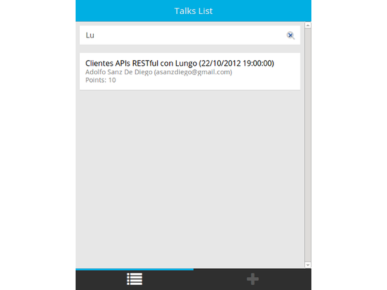

## js/talk/talk-list.js

~~~{.JavaScript}
$$('document').ready(function(){

 // get data from server
 util_ajaxGet('/talk', {}, function(json) {
  if(!json || json.error) {
   util_errorNotification('ERROR retrieving talks', json.error);
  } else {
   drawTalks(json);
  }
 });

 // draw data
 var drawTalks = function(talks) {
  for (var i = 0; i < talks.length; i++) {
   var talk = talks[i];
   $$("#talks").append(
    '<li data-action="search" class="selectable">'+
     '<a href="talk-edit.html?talkId='+talk._id+'">'+
      '<strong>'+talk.talkName+'</strong></a></li>');
  }
 };
});
~~~

# Demo

# ¿Alguna pregunta?
