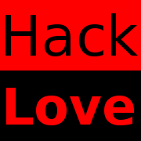
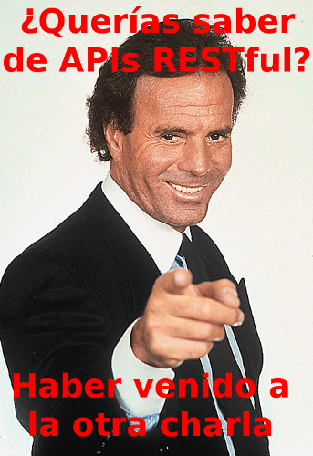

% Cliente API REST con LungoJS
% Adolfo Sanz De Diego
% Octubre 2013

# Acerca de

## El GUL

- El GUL es el **Grupo de Usuarios de Linux de la UC3M**.
- Grupo de personas con inquietudes en torno a la informática.
- Con la idea común de la utilización y promoción del **Software Libre**.
- Quedamos de vez en cuando y organizamos actividades sobre todo esto.
- El punto de unión es la **lista de correo** que está abierta a todo el mundo.

## ¿Dónde encontrarnos?

- Twitter: [@guluc3m](http://twitter.com/guluc3m)
- Lista: [gul@gul.uc3m.es](mailto:gul@gul.uc3m.es)
- Ftp: [ftp://ftp.gul.uc3m.es](ftp://ftp.gul.uc3m.es)
- Web: [http://www.gul.uc3m.es](http://www.gul.uc3m.es)
- Podcast: [http://holamundo.gul.es/](http://holamundo.gul.es/)
- Blog: [http://planeta.gul.uc3m.es/](http://planeta.gul.uc3m.es/)
- Linkedin: [http://www.linkedin.com/groups?gid=3451836](http://www.linkedin.com/groups?gid=3451836)

## Adolfo Sanz De Diego

## Mi CV resumido

- **Antiguo programador web JEE**

- Hoy en día:

    - **Profesor de FP de informática**:
    
            - Hardware, Sistemas Operativos, Redes, Programación
    
    - **Formador Freelance**:
    
            - Java, Android
            - JavaScript, jQuery
            - JSF, Spring, Hibernate y Groovy&Grails
    
    - Programo en mis tiempos libres.

## Hackalover

- **Meetup**: [http://www.meetup.com/Hackathon-Lovers/](http://www.meetup.com/Hackathon-Lovers/)

- **Twitter**: [http://twitter.com/HackathonLovers](http://twitter.com/HackathonLovers)

## ¿Donde encontrarme?

- Mi nick: **asanzdiego**

- AboutMe: **[http://about.me/asanzdiego](http://about.me/asanzdiego)**

    - [GitHub](http://github.com/asanzdiego/)
    - [Twitter](http://twitter.com/asanzdiego)
    - [Blog](http://asanzdiego.blogspot.com.es)
    - [LinkedIn](http://www.linkedin.com/in/asanzdiego)
    - [Google+](http://plus.google.com/118434794733307240711)
    
## Licencia

- Estas **transparencias** están bajo una licencia:
    - [Creative Commons Reconocimiento-CompartirIgual 3.0](http://creativecommons.org/licenses/by-sa/3.0/es/)

- El **código fuente** de los programas están bajo una licencia:
    - [GPL 3.0](http://www.viti.es/gnu/licenses/gpl.html)

# APIs ¿Para qué?

## Haber venido

## Aplicación

## Plataforma

## ¿Quien expone APIs?

## Exponlas tú

## Exponlas tú

## Exponlas tú

# APIs RESTful

## ¿Qué es REST?

- Una **URL** (Uniform Resource Locator) representa un **recurso**.

- Se puede acceder al recurso o modificarlo mediante los **métodos del protocolo HTTP**:

        - POST, GET, PUT, DELETE

## Ejemplo API

- **http://myhost.com/talk**

    - GET > Devuelve todas las charlas.
    - POST > Crear una nueva charla.
    
- **http://myhost.com/talk/123**

    - GET > Devuelve la charla con id=123
    - PUT > Actualiza la charla con id=123
    - DELETE > Borra la charla con id=123

## Manejo de errores

- **Se pueden utilizar los errores del protocolo HTTP**:

    - 200 Successful
    - 201 Created
    - 202 Accepted
    - 301 Moved Permanently
    - 400 Bad Request
    - 401 Unauthorised
    - 402 Payment Required
    - 403 Forbidden
    - 404 Not Found
    - 405 Method Not Allowed
    - 500 Internal Server Error
    - 501 Not Implemented

## ¿Por qué REST?

- Es **más sencillo** (tanto la API como la implementación).
- Es **más rápido** (peticiones más lijeras que se pueden cachear).
- Es **multiformato** (HTML, XML, JSON, etc.).
- Se complementa muy bien con **AJAX**.

# Clientes multidispositivo

## Distintos dispositivos

## Distintos OS

## Distintos OS

## Distintos navegadores

## ¡¡¡Socorro!!!

## Al rescate

## Graceful Degradation

## Graceful Degradation

## Progressive Enhancement

## Phonegap

# Lungo.js

## Competidores

- [jQTouch](http://jqtjs.com/)
- [Sencha Touch](http://www.sencha.com/products/touch/)
- [jQueryMobile](http://jquerymobile.com/)
- [hammer.js](http://eightmedia.github.io/hammer.js/)

## ¿Por qué Lungo?

## Licencia GPL

## Española

## Pues no

## Me gusta

## Aburrido

# Código

## Aplausos

## Directorios

- Puedes usar la estructura de directorios que quieras.

- Yo he usado esta:

    - **html**: los HTML con una carpeta para cada entidad del domino
    - **js**: los JS con una carpeta para cada entidad del domino
    - **lib**: carpeta con las dependencias a otros proyectos
    
        - Lungo depende de Quo que es una librería de los mismos auotres
          de 'tipo' jQuery enfocada a móviles

## js/util.js

~~~{.JavaScript}
// Searh
$$('document').ready(function(){
    Lungo.dom('input[type=search]').on('keyup', ...);
});

// Date format
var util_dateFormat = "DD/MM/YYYY HH:mm:ss";

// Server URL
var util_server_url = "http://localhost:3000";

// Error Notification
var util_errorNotification = function(message, error) {
    Lungo.Notification.error(message, "", "warning-sign", 2);
};

// Métodos REST
var util_ajaxGet = function(url, data, callback) {
    $$.get(util_server_url+url, data, ..., 'json');
};
var util_ajaxPost = function(url, data, callback) {...};
var util_ajaxPut = function(url, data, callback) {...};
var util_ajaxDelete = function(url, data, callback) {...};
~~~

## html/talk/talk-add.html

~~~{.html}
<body class="app">
 <section id="main" data-transition="">
  <header data-title="Add Talk" class="extended"></header>
  <footer>
   <nav>
    
    
   </nav>
  </footer>
  <article id="main-article" class="active list">
   

    <fieldset>
     <label>NAME:</label><input type="text" id="talkName" />
    </fieldset>
    ...
    <fieldset>
     <label>NUM:</label><input type="number" id="talkNum" />
    </fieldset>
   

   

    <a href="#addTalk" id="addTalk" class="button">Add</a>
    <a href="talk-list.html" class="button cancel">Cancel</a>
   

  </article>
 </section>
 
</body>
~~~

## html/talk/talk-add.html

## js/talk/talk-add.js

~~~{.JavaScript}
$$('#addTalk').tap(function(){

 var data = {
  talkName:        $$("#talkName").val(),
  talkDate:        util_stringToDate($$("#talkDate").val()),
  talkSpeaker:     $$("#talkSpeaker").val(),
  talkSpeakerMail: $$("#talkSpeakerMail").val(),
  talkPoints:      $$("#talkPoints").val()
 };

 // send data to server
 util_ajaxPost('/talk', data, function(json) {
  if(!json || json.error) {
   util_errorNotification('ERROR adding talk', json.error);
  } else {
   util_successNotification('Talk saved', function() {
    window.location.replace('talk-list.html');
   });
  }
 });

});
~~~

## html/talk/talk-edit.html

~~~{.html}
<body class="app">
 <section id="main" data-transition="">
  <header data-title="Edit Talk" class="extended"></header>
  <nav data-control="groupbar">
   <a href="#editTalkArticle" ...>Edit</a>
   <a href="#deleteTalkArticle" ...>Delete</a>
  </nav>
  <footer>
   ...
  </footer>
  <article id="editTalkArticle" class="list indented scroll">
   ...
  </article>
  <article id="deleteTalkArticle" class="list indented scroll">
   ...
  </article>
 </section>
 
</body>
~~~

## html/talk/talk-edit.html

## html/talk/talk-edit.html

## js/talk/talk-get.js

~~~{.JavaScript}
$$('document').ready(function(){
 
 var talkId = util_urlParams["talkId"];
 
 // get data from server
 util_ajaxGet('/talk/'+talkId, {}, function(json) {
  if(!json || json.error) {
   util_errorNotification('ERROR retrieving talk', json.error);
  } else {
   var talk = json;
   console.log('Talk retrieved');
   drawTalk(talk);
  }
 });
 
 // draw data
 var drawTalk = function(talk) {
  $$("#talkName").val(talk.talkName);
  $$("#talkDate").val(util_dateToString(talk.talkDate));
  $$("#talkSpeaker").val(talk.talkSpeaker);
  $$("#talkSpeakerMail").val(talk.talkSpeakerMail);
  $$("#talkPoints").val(""+talk.talkPoints);
 };

});
~~~

## js/talk/talk-update.js

~~~{.JavaScript}
$$('#saveTalk').tap(function(){

 var talkId = util_urlParams["talkId"];

 var data = {
  talkName:        $$("#talkName").val(),
  talkDate:        util_stringToDate($$("#talkDate").val()),
  talkSpeaker:     $$("#talkSpeaker").val(),
  talkSpeakerMail: $$("#talkSpeakerMail").val(),
  talkPoints:   $$("#talkPoints").val()
 };

 // send data to server
 util_ajaxPut('/talk/'+talkId, data, function(json) {
  if(!json || json.error) {
   util_errorNotification('ERROR saving talk', json.error);
  } else {
   util_successNotification('Talk saved', function() {
    window.location.replace('talk-list.html');
   });
  }
 });

});
~~~

## js/talk/talk-delete.js

~~~{.JavaScript}
$$('#deleteTalk').tap(function(){

 var talkId = util_urlParams["talkId"];

 // send data to server
 util_ajaxDelete('/talk/'+talkId, {}, function(json) {
  if(!json || json.error) {
   util_errorNotification('ERROR deleting talk', json.error);
  } else {
   util_successNotification('Talk deleted', function() {
    window.location.replace('talk-list.html');
   });
  }
 }); 

});
~~~

## html/talk/talk-list.html

~~~{.html}
<body class="app">
 <section id="main" data-transition="">
  <header data-title="Talks List" class="extended"></header>
  <footer>
   <nav>
    
    
   </nav>
  </footer>
  <article id="main-article" class="active list indented scroll">
   

    <fieldset data-icon="search">
     <input type="search" placeholder="Search...">
    </fieldset>
   

   <ul id="talks"></ul>
  </article>
 </section>
 
</body>
~~~

## html/talk/talk-list.html

## html/talk/talk-list.html

## js/talk/talk-list.js

~~~{.JavaScript}
$$('document').ready(function(){

 // get data from server
 util_ajaxGet('/talk', {}, function(json) {
  if(!json || json.error) {
   util_errorNotification('ERROR retrieving talks', json.error);
  } else {
   var talks = json;
   console.log(talks.length+' talks retrieved');
   drawTalks(talks);
  }
 });
 
 // draw data
 var drawTalks = function(talks) {
  for (var i = 0; i < talks.length; i++) {
   var talk = talks[i];
   $$("#talks").append(
    '<li data-action="search" class="selectable">'+
     '<a href="talk-edit.html?talkId='+talk._id+'">'+
      '<strong>'+talk.talkName+'</strong>'+
      '<small>'+talk.talkSpeaker+'</small></a></li>');
  }
 };

});
~~~

# Demo

# ¿Alguna pregunta?
